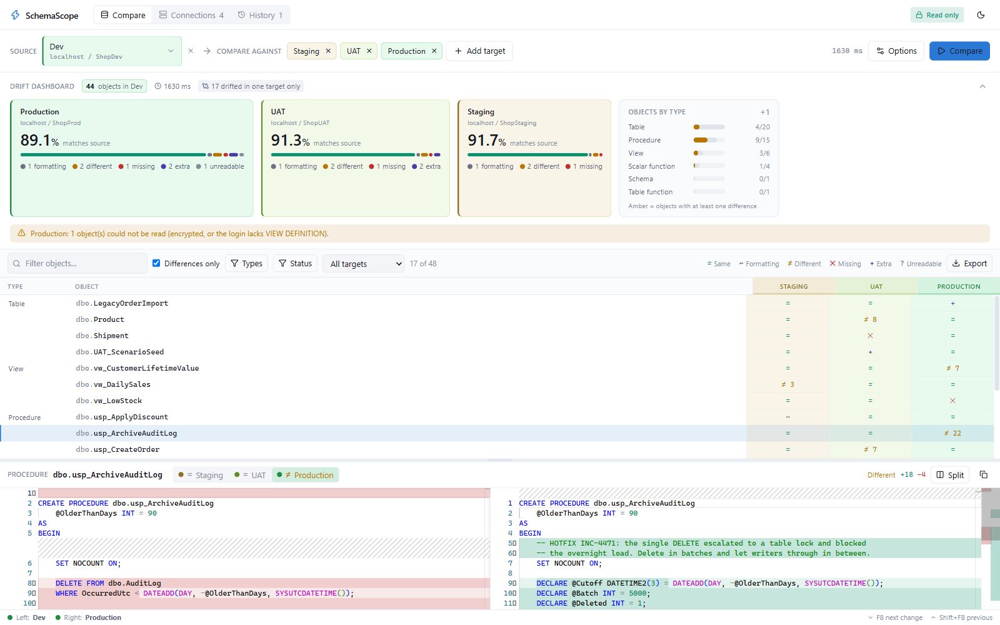
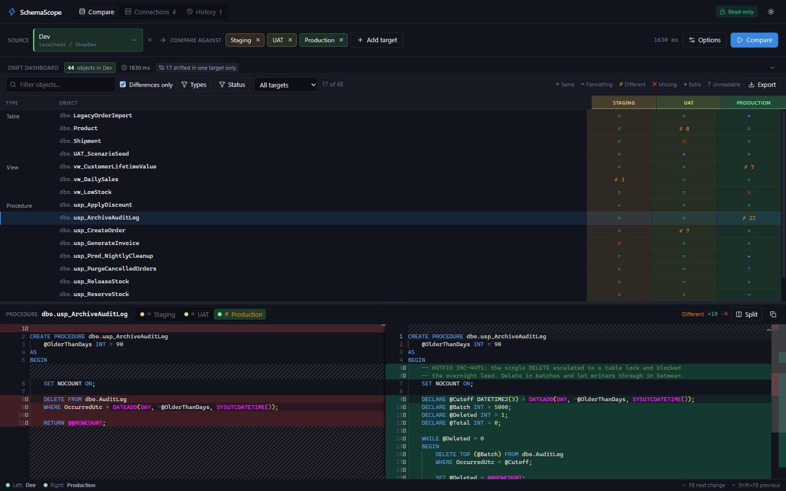
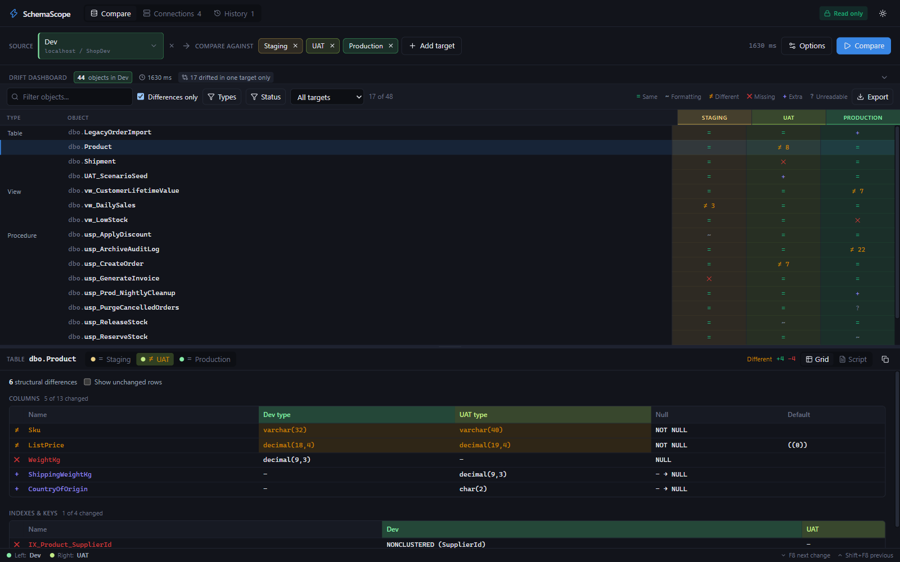

<p align="center">
  
</p>

<h1 align="center">SchemaScope</h1>

<p align="center">
  <b>Compare one SQL Server database against all your environments at once — in about a second.</b>
</p>

<p align="center">
  <a href="https://schemascope.shadowmark.in"><b>schemascope.shadowmark.in</b></a>
  &nbsp;·&nbsp;
  <a href="https://github.com/Shrikant-satpute/schemascope/releases/latest/download/SchemaScope-Setup.exe"><b>Download for Windows</b></a>
  &nbsp;·&nbsp;
  <a href="SECURITY.md">Security</a>
</p>

<p align="center">
  <a href="LICENSE"></a>
  <a href="../../actions/workflows/ci.yml"></a>
  
</p>

---

<p align="center">
  <picture>
    <source media="(prefers-color-scheme: dark)" srcset="assets/screenshots/dashboard-dark.png">
    
  </picture>
</p>

<p align="center"><i>One source, three environments, one screen. Dev on the left, everything that drifted on the right.</i></p>

---

## What it does

You have one database you trust — call it Dev. You also have Staging, UAT and
Production, and you are not completely sure they still match.

SchemaScope answers that in one shot. Pick the source, add as many targets as
you want, press **Compare**. You get:

- a score per environment — *"Production is 89.1% the same as Dev"*
- a list of every object that is different, missing, or extra
- the actual difference, side by side, in the VS Code editor

**It never writes to your databases.** There is no code in SchemaScope that
writes. It only reads, and it only ever gives you scripts and reports. What you
do with those is your call, in your own tools.

---

## Why not just use Visual Studio?

Straight answer: **Visual Studio's Schema Compare sucks at this job.**

It is fine at what it was built for — pushing one database into another. Ask it
the question people actually ask on a Friday afternoon, *is production still the
same as dev?*, and it wastes your afternoon.

- **It is slow. Every single time.** Before it says one word, it builds a full
  model of both databases. On a big database that is minutes of watching a
  progress bar, and you pay it again on every run.
- **One pair at a time. That is it.** Four environments means running it four
  times, waiting four times, and then holding four sets of results in your head.
- **It cries wolf.** Re-indent a stored procedure and it screams "changed". The
  one difference that will actually break production is buried in that noise.
- **It drags a whole IDE along.** A DBA who does not write C# should not have to
  install a multi-gigabyte IDE to find out whether last night's release landed.
- **It is the wrong tool pointed at production.** Schema Compare exists to write
  to a database. If all you wanted was an answer, that is a lot of loaded gun to
  be holding.

SchemaScope does the one job, properly. Measured on a real 1,189 object database
against a 990 object copy:

| | SchemaScope | VS Schema Compare |
|---|---|---|
| Read both databases | 500 ms | — |
| Compare and classify | 296 ms | — |
| **Total** | **806 ms** | **60–180 seconds** |
| Targets per run | as many as you like | one |
| Needs Visual Studio | no | yes |

Four target databases take about the same time as one, because they are read at
the same time.

### How it is that fast

1. **Read the catalog, not the model.** Two round trips per database: check the
   version, then one batch that returns everything. Never one query per object.
2. **Hash first, look later.** Every object gets a SHA-256 of its cleaned-up
   text. Same hash means the object is identical, and it is never opened again —
   that is usually 90% or more of the database.
3. **Compare tables as data, not as text.** Columns, indexes and constraints are
   built from catalog metadata by the *same code* on both sides, so formatting
   can never invent a fake difference.
4. **Do all targets at once**, in parallel.
5. **Run the expensive check last.** The T-SQL parser only runs on bodies that
   already look nearly identical. Skipping it on the obviously different ones
   took the compare stage from 1693 ms down to 296 ms.
6. **Stream results to the screen** as each database finishes.

---

## Six answers, not two

Most tools say "same" or "different". That is why a re-indented procedure looks
like a change and the real one gets buried.

| | Status | What it means |
|:-:|---|---|
| `=` | Same | Identical to the source |
| `~` | Formatting | Same code. Only spacing, comments or brackets moved |
| `≠` | Different | A real difference, with the number of changed lines |
| `✕` | Missing | In the source, but not in this target |
| `+` | Extra | Only in this target — usually a local change |
| `?` | Unreadable | Encrypted, or your login lacks `VIEW DEFINITION` |

Nothing is ever hidden. An ignore rule moves an object down to *Formatting*
instead of making it disappear.

Every status has a symbol and a word as well as a colour, and the colours are
checked for colour blindness in both light and dark mode.

---

## What you see

### Real diffs, in the VS Code editor

<p align="center">
  
</p>

Monaco — the editor from VS Code — with real line numbers, side by side or
inline. `F8` and `Shift+F8` jump between changes.

### Tables compared field by field

<p align="center">
  
</p>

A text diff lights up a whole `CREATE TABLE` when one column is renamed. The
grid shows you only the cells that actually differ — plus indexes, keys and
constraints.

### And the rest

- **Drift dashboard** — one tile per environment: how much still matches, a
  breakdown bar, and counts you can click to filter.
- **"Drifted in exactly one target"** — objects that changed in a single
  environment. Almost always a local change rather than a missed release.
- **Matrix grid** — one row per object, one column per target. Virtualized, so
  thousands of rows stay smooth.
- **Export** — a standalone HTML report, CSV, Markdown for the wiki, or one
  `.sql` file per object into a folder.

---

## Your schema never leaves your machine

This is built in, not promised in a policy document:

- Connections and passwords live in
  `%LOCALAPPDATA%\SchemaScope\schemascope.db`. Passwords are encrypted with
  Windows DPAPI under your account, so no other Windows user can read them.
- The UI is served from inside the exe, under a
  `Content-Security-Policy` of `default-src 'self'`. A request to an outside
  host is not blocked by our code — the browser engine refuses to make it.
- The window will not navigate anywhere except its own loopback address.
- No telemetry. No update check. No network calls of any kind. The only
  connections it opens are to the databases you named.

---

## Installing

[**Download SchemaScope-Setup.exe**](https://github.com/Shrikant-satpute/schemascope/releases/latest/download/SchemaScope-Setup.exe)
and run it. It installs for your account only, so Windows never asks for
administrator rights, and it offers a desktop shortcut.

Prefer nothing installed? [`SchemaScope.exe`](https://github.com/Shrikant-satpute/schemascope/releases/latest)
is the portable build — one self-contained file, no .NET install needed, nothing
to unpack, no files beside it.

### From Scoop

```powershell
scoop install https://raw.githubusercontent.com/Shrikant-satpute/schemascope/main/packaging/scoop/schemascope.json
```

This installs the portable build and keeps it up to date with `scoop update`. It
also skips the SmartScreen warning below — that warning comes from a mark
browsers attach to downloaded files, and a package manager never adds it.

WebView2 is required and ships with Windows 10 and 11. If it is somehow missing,
you get a plain explanation and a download link.

### Windows will warn you the first time

The binaries are not code-signed yet, so SmartScreen shows *"Windows protected
your PC"*. Click **More info**, then **Run anyway**.

You do not have to take that on trust. Every release is built in public by
GitHub Actions from the tagged commit, and ships a `SHA256SUMS.txt`:

```powershell
Get-FileHash .\SchemaScope-Setup.exe -Algorithm SHA256
```

### What it needs on the server

A login that can read the catalog:

```sql
GRANT VIEW DEFINITION TO [your_login];
```

Without it, SchemaScope still sees object names but not their bodies. It says so
per object instead of reporting a false difference, and the connection test
warns you up front.

---

## Building

```powershell
.\build.ps1              # front end + single file exe -> dist\SchemaScope.exe
.\build.ps1 -SkipWeb     # C# only
```

Needs the .NET 9 SDK and Node 20+.

### Working on the front end

```powershell
# terminal 1 - the API on a fixed port
dotnet run --project src\SchemaScope.Shell -- --server --port 5199

# terminal 2 - Vite with hot reload, proxying /api to 5199
cd web
npm run dev
```

### Measuring the engine

The Phase 0 spike is still in the repo. It reports stage timings and, more
usefully, every object that differs *only* by formatting — each one is a
normalizer rule worth reviewing before trusting the tool on a new database.

```powershell
dotnet run --project src\SchemaScope.Spike -c Release -- `
  -s "Server=localhost;Database=Dev;Integrated Security=true;TrustServerCertificate=true" `
  -t "Server=localhost;Database=Prod;Integrated Security=true;TrustServerCertificate=true"
```

---

## Layout

```
src/
  SchemaScope.Core        models, T-SQL normalizer, hashing, diff engine, local store
  SchemaScope.SqlServer   catalog reader, connection handling
  SchemaScope.Api         minimal API + SSE, embeds the built UI
  SchemaScope.Shell       WebView2 window, single file exe entry point
  SchemaScope.Spike       Phase 0 measurement console
web/                      React + TypeScript + Vite + Tailwind + Monaco
site/                     the landing page at schemascope.shadowmark.in
```

Works with SQL Server 2012 and later, Azure SQL Database, Azure SQL Managed
Instance and AWS RDS. The catalog queries adjust to the server version.

---

## Not in this version

Deployment scripting. Comparing is a solvable problem. Generating a correct
deploy script for every edge case — dependency order, drop and recreate, keeping
the data — is a much bigger one, and shipping half of it would be worse than not
shipping it. Export the objects as `.sql` and review them yourself.

---

## Links

- **Website** — <https://schemascope.shadowmark.in>
- **Download** — [latest release](https://github.com/Shrikant-satpute/schemascope/releases/latest)
- **Report an issue** — <https://github.com/Shrikant-satpute/schemascope/issues>

## Contributing

See [CONTRIBUTING.md](CONTRIBUTING.md) for the build, the dev loop and where
tests are expected. Found a security issue? [SECURITY.md](SECURITY.md) — please
report it privately rather than in an issue.

## License

[Apache-2.0](LICENSE). Built by [Shadowmark](https://shadowmark.in).
